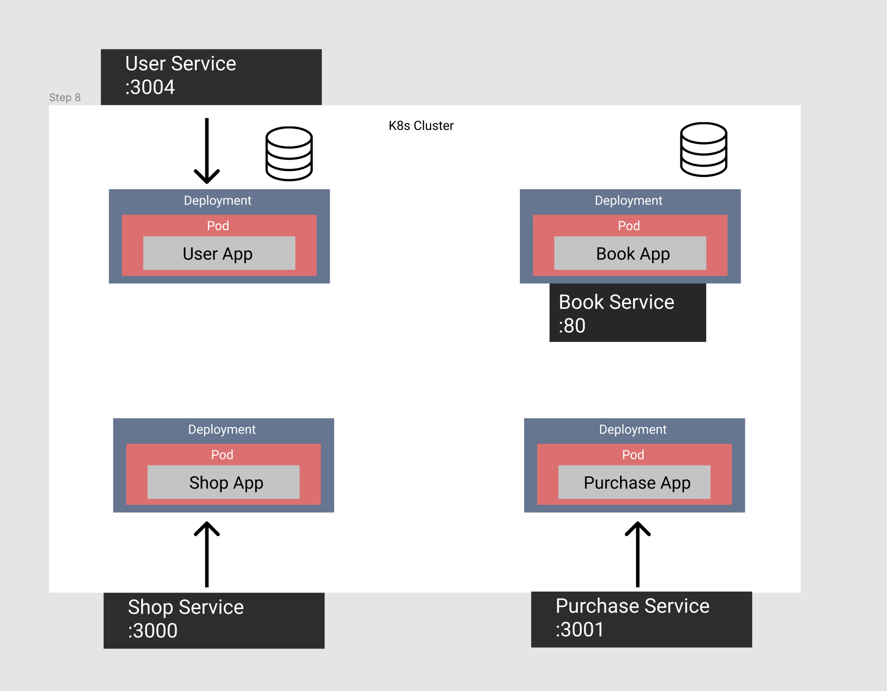
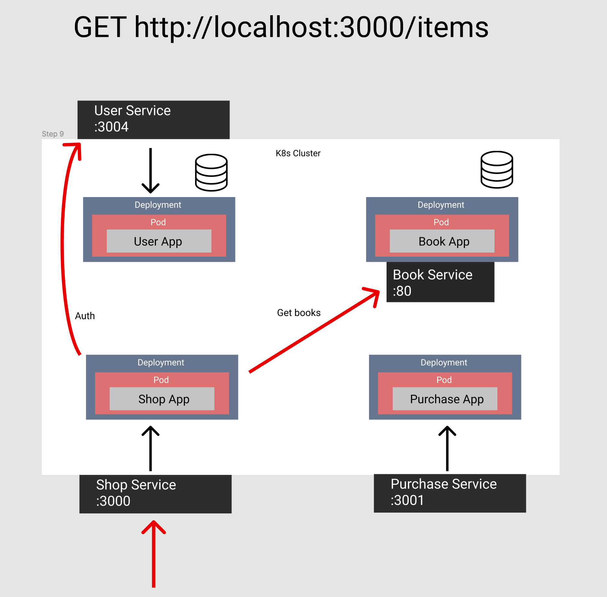

## Starting the cluster

**Make sure your context is set to a local cluster (minikube or docker desktop)**

_Must have node installed_

To build all images, deployments, services and the config map, execute the command `./build-everything.sh`

## Endpoints

### Login

Make a request to `POST http://localhost:3004/login` with the following request body:

```
{
  "email": "Don@test.com"
}
```

For all subsequent requests, set the header `authrization` to the value of `token` from the response

### Get Items

Make a request to `GET http://localhost:3000/items`

### Purchase Item

Make a request to `POST http://localhost:3001/purchase` with the following request body:

```
{
  "itemId": {any ID from the /items response}
}
```

## Tear down cluster

`./delete-all.sh`

## Cluster Architecture




